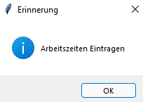

# Zeiterfassungstool 

    
  

## Initiales Setup

### Python installieren

Zur Verwendung dieses Tools ist aktuell die Installation von Python notwendig. 
Unter folgendem Link: https://www.python.org/downloads/

Wichtig ist dabei, dass man bei der Installation den Haken bei dem Kontrollkästchen setzt, um Python zum PATH hinzuzufügen.

Shell/Commandline öffnen und die folgenden Befehle ausführen:
`pip install tkcalendar`
`pip install pandas`
`pip install matplotlib`

### Konfiguration
Für die erste Verwendung ist es notwendig die Dropdownfelder zu konfigurieren, um dieses Zeiterfassungstool für den aktiven Arbeitseinsatz nutzen zu können.  

Zur Auswahl stehen dafür die Dropdownfelder:

- PSP (Projektstrukturplan-Elemente):
	
	- Es können alle nötigen PSP Elemente hinzugefügt werden, die entsprechende Liste (`pspListe`) befindet sich in der Datei `config.py`.

- Kunde:

	- Hier können gängige Kundennamen eingetragen werden, um das Dokumentieren der Arbeitszeiten zu beschleunigen.
	- Diese Änderungen müssen ebenfalls in der `config.py` Datei durchgeführt werden.
	- Bitte die Liste der Variable `KundeListe` anpassen.

- Zeiten:

	- Ebenfalls ist es möglich Standardzeiten für einzelne Aufgaben zu hinterlegen.
	- Diese Konfiguration ist in der Datei `config.py` vorzunehmen.
	- Hierzu ist die Liste der Variable `ZeitenListe` anzupassen. 

### Automatischer Start

1. Es empfiehlt sich dieses Repo zu klonen bzw. runterzuladen und Lokal auf dem Client zu sichern. 
2. Im Anschluss daran sollte eine Verknüpfung der `main.py` angelegt werden.
3. Darauffolgend kann mittels der Tastenkombination `Windows + R` ein Eingabefenster geöffnet werden. Es öffnet sich der Dialog „Ausführen.“ 
Nun kann "shell:startup" in die „Öffnen-Zeile“ eingetragen werden und mit Enter bestätigt werden.
4. Die in Schritt 2. erzeugte Verknüpfung muss nun in das durch Schritt Nr. 3. verschoben werden. 

So wird dieses Skript bei jedem Systemstart automatisch gestartet und die Eingabe-GUI öffnet sich automatisch.

## Betrieb und Verwendung
### Daily Use  

Nach dem Start öffnet sich die folgende GUI

Nach der initialen Konfiguration sind durch die Dropdown-Menüs PSP-, Kunden- und Dauer-Parameter auswählbar. 

Durch `Speichern` werden die eingetragenen Parameter gesichert. 

Sollte in dem Feld `Sleeptimer (min)` eine Zahl (Zeit in Minuten) eingetragen werden und der Button `Sleeptimer` verwendet werden, werden ebenfalls alle Parameter für die Datenauswertung gesichert und im Anschluss wird die Anwendung minimiert. Nach Ablauf der Zeit erscheint eine Erinnerung zum erneuten Eintragen der Arbeitszeiten.

Sollten Fehler unterlaufen sein und eine Korrektur muss durchgeführt werden, so ist derzeit die manuelle Bearbeitung der CSV Datei (`log.csv`) erforderlich.

### Auswertung der Daten zum Eintragen der Arbeitszeiten

Um die Arbeitszeiten auszuwerten, kann die Datei `Auswertung.xlsx` geöffnet werden.
Nach der Aktualisierung der Daten unter dem Menüpunkt `Daten` sind die, durch die GUI, hinterlegten Daten einsehbar. 
Unter dem Datenblatt `Auswertung` befindet sich eine Pivot-Tabelle, diese kann ebenfalls aktualisiert werden und dazu genutzt werden, die Arbeitszeiten innerhalb kürzester Zeit in einem Tool deiner Wahl einzutragen. 

