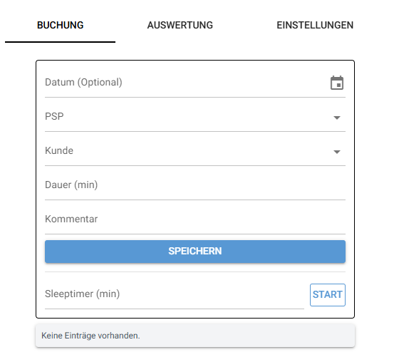

# Zeiterfassung-ESS


Installation direct:
```bash
python -m pip install -r requirements.txt
```

Installation via venv:
```bash
python -m venv .venv
.\.venv\Scripts\Activate.ps1
python -m pip install -r requirements.txt
```

Usage: 
```bash
python main.pyw
```

Autostart: 
```bash
.\add_to_startup.ps1
```

## User Guide

This application is designed to make time tracking simple and efficient. Below is a guide to the main functions available in each tab.



### 1. Booking Tab (Time Recording)
The **Buchung** tab is the primary interface for logging your work.
*   **Date**: Defaults to the current date. Click the calendar icon to select a different day.
*   **PSP (Project)**: Select the appropriate project element from the dropdown list.
*   **Customer**: Choose the associated customer (optional).
*   **Duration**: Enter the time worked in minutes.
*   **Comment**: Provide a brief description of the task. As you type, suggestions from your "Settings" templates will appear.
*   **Sleeptimer**: A built-in productivity timer. Enter a duration (e.g., 60 minutes) and click "Start". The app will minimize and notify you when the time is up, serving as a reminder to log your activity.


### 2. Analysis Tab (Reports)
The **Auswertung** tab provides a structured overview of your logged hours.
*   **Weekly Overview**: Records are grouped by Calendar Week (KW), showing the total hours worked that week.
*   **Daily Breakdown**: Expand a week to see entries day-by-day, with daily hour totals.
*   **Project Details**: Expand a day to see exactly which separate Time-Slots were booked for which PSP element.
*   This view helps you verify your timesheet and ensure all hours are accounted for.


### 3. Settings Tab (Configuration)
The **Einstellungen** tab allows you to customize the application's data to fit your workflow.
*   **PSP Elements**: Manage your list of active project codes.
*   **Customers**: Maintain a list of clients you frequently work for.
*   **Comments**: Create templates for recurring tasks (e.g., "Daily Standup", "Email support") to speed up entry.
*   **How to Add**: Type the new item into the input field and click the `+` button.
*   **How to Remove**: Click the small `x` on any existing item tag to permanently remove it.


